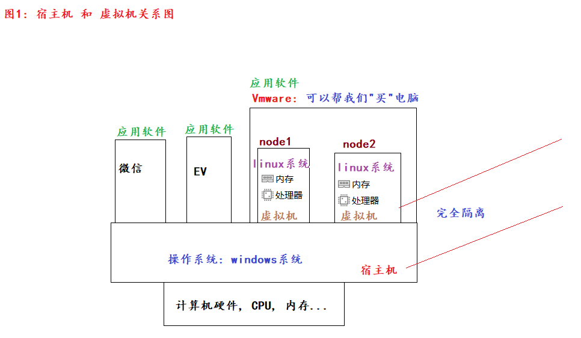

### 一、计算机初识

- 概述
    - 全称：电子计算机，俗称：电脑。由**硬件**和**软件**组成。
- 组成
    - 硬件：看得见摸得着
        - CPU（运算器 + 控制器）
        - 存储器
            - 内存：内存条
            - 外存：SSD（固态硬盘），HSD（混合硬盘），HDD（机械硬盘）
        - 输入设备
            - 键鼠组合
        - 输出设备
            - 音响
            - 显示器
            - 打印机
    - 软件：看不见摸不着，但是可以直接使用
        - 系统软件
            - PC端：Windows、Linux、Mac
            - 移动端：Android、IOS、鸿蒙
- 扩展
    - **操作系统是用户和计算机硬件之间的桥梁，用户通过操作操作系统控制硬件干活。**
    - 没有操作系统的电脑称为：裸机。

### 二、linux系统简介

- 概述
    - 目前服务器端使用最多的操作系统，支持7 * 24小时高性能服务。
- 常用的发行版
    - RedHat：IBM公司的产品。功能强大、收费
    - CentOS：RedHat的免费版
    - Ubantu：界面做的比较好的，适合小白
    - 中标麒麟、红旗：国内的

### 三、虚拟机和宿主机的关系



### 四、Linux基础命令

- Linux命令的格式

```shell
# Linux命令格式如下（中括号表示可选）：
command [-options] [parameter]  # 命令名 [-选项] [参数]
```

- ls命令

```shell
ls  # 查看当前目录的子级（不包括隐藏）。等价于 ls ./
ls -a  # 查看当前目录的子级（包括隐藏）
ls -al  # 以行的方式查看当前目录的子级(包括隐藏的)
ls -alh  # 以行、人性化的方式查看当前目录的子级(包括隐藏的)
```

- cd命令

```shell
cd  # 回家。即：root账号的家目录是 /root，其它账号的家目录是 /home
cd /etc  # 切换到etc目录
cd ..  # 返回上1级目录
cd ../  # 效果同上
cd ../..  # 返回上上级路径
cd ~  # 等价于cd命令
```

- pwd命令

```shell
pwd  # 当前在哪个目录就打印什么路径
```

- mkdir命令

```shell
mkdir ./aa  # 在当前目录下创建aa文件夹
mkdir ./1.txt  # 在当前目录下创建 1.txt文件
mkdir -p aa/bb/cc	# 创建多级目录
```

- 文件相关的命令

```shell
touch 1.txt 2.mp3 abc.jpg  # 同时创建多个文件
cat 文件路径  # 查看文件中所有的内容。如果内容较多则只显示最后1页
more 文件路径  # 分页查看数据。d(down)：往下翻页；b(back)：往上翻页；q(quit)：退出
cp 1.txt /aa  # 拷贝1.txt到/aa目录下
cp 1.txt /aa/2.txt  # 拷贝1.txt到/aa目录下，并改名为2.txt
cp -r aa test  # 拷贝aa文件夹到test文件夹下。-r：递归拷贝
mv 1.txt 2.txt  # 改名
rm -rf 1.txt  # 删除(当前目录下的)1.txt文件
rm -rf *.txt  # 删除(当前目录下的)所有的.txt文件
rm -rf aa  # 删除aa文件夹
rm -rf /  # "坐牢命令"，等价于格式化C盘
rm -rf /*  # 效果同上
```

- 查找命令相关

```shell
# which：查看命令所在的路径
which ls  # /usr/bin/
which cd  # /usr/bin
which ifconfig  # /usr/sbin/

find / -name 'abc*'  # 去根目录下查找所有以abc开头的文件
find / -size +100M  # 去根目录下查找,文件大小在100MB以上的文件
```

- echo和重定向命令

```shell
echo 'hello world'  # 打印hello world
echo 'hello' > 1.txt  # 把hello覆盖写入到1.txt文件
echo 'hello' >> 1.txt   # 把hello字符串追加写入到1.txt文件
```

- 管道符、统计、过滤命令

```shell
# 准备数据
echo 'hello python' > 1.txt
echo 'world python' >> 1.txt

grep -n 'world' 1.txt  # -n：显示行号
wc -lwc 2.txt  # 统计行数、单词数、字节数  -m：字符数

# | 管道命令。把前面命令的执行结果当做后面的数据源
ls / | wc -w
```

- tail、反引号

```shell
echo `pwd`  # 反引号中的内容当做Linux命令

tail 3.txt  # 查看文件末尾10行（默认）的数据
tail -5 3.txt  # 查看文件末尾5行的数据据
tail -10f log.txt  # 动态查看文件的末尾的10行数据
```