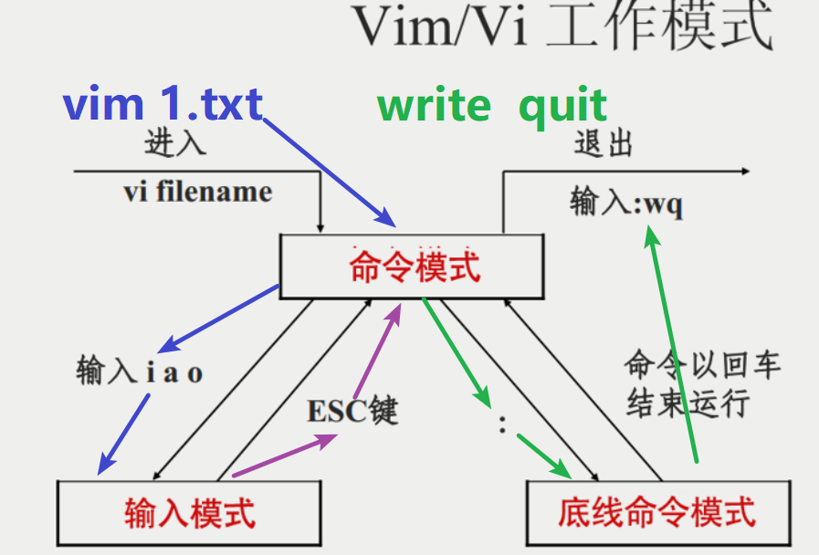
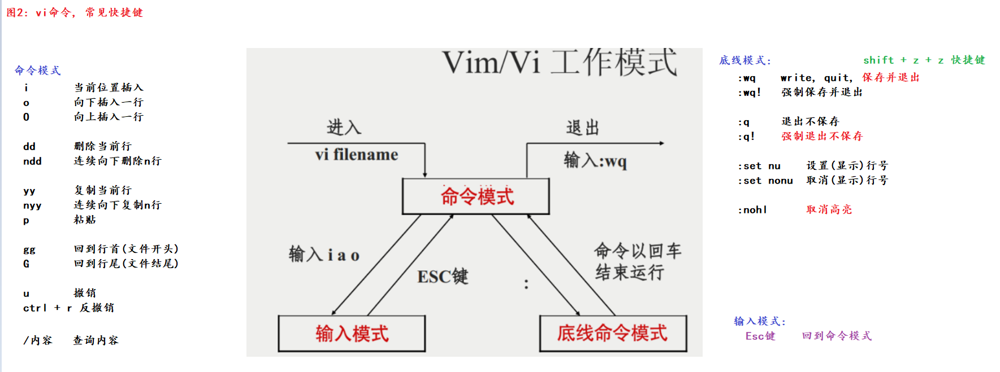
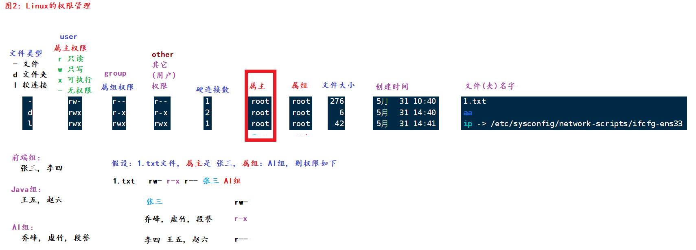

### 一、计算机初识

- 概述
    - 全称：电子计算机，俗称：电脑。由**硬件**和**软件**组成。
- 组成
    - 硬件：看得见摸得着
        - CPU（运算器 + 控制器）
        - 存储器
            - 内存：内存条
            - 外存：SSD（固态硬盘），HSD（混合硬盘），HDD（机械硬盘）
        - 输入设备
            - 键鼠组合
        - 输出设备
            - 音响
            - 显示器
            - 打印机
    - 软件：看不见摸不着，但是可以直接使用
        - 系统软件
            - PC端：Windows、Linux、Mac
            - 移动端：Android、IOS、鸿蒙
- 扩展
    - **操作系统是用户和计算机硬件之间的桥梁，用户通过操作操作系统控制硬件干活。**
    - 没有操作系统的电脑称为：裸机。

### 二、linux系统简介

- 概述
    - 目前服务器端使用最多的操作系统，支持7 * 24小时高性能服务。
- 常用的发行版
    - RedHat：IBM公司的产品。功能强大、收费
    - CentOS：RedHat的免费版
    - Ubantu：界面做的比较好的，适合小白
    - 中标麒麟、红旗：国内的

### 三、虚拟机和宿主机的关系


### 四、Linux基础命令

- Linux命令的格式

```shell
# Linux命令格式如下（中括号表示可选）：
command [-options] [parameter]  # 命令名 [-选项] [参数]
```

- ls命令

```shell
ls  # 查看当前目录的子级（不包括隐藏）。等价于 ls ./
ls -a  # 查看当前目录的子级（包括隐藏）
ls -al  # 以行的方式查看当前目录的子级(包括隐藏的)
ls -alh  # 以行、人性化的方式查看当前目录的子级(包括隐藏的)
```

- cd命令

```shell
cd  # 回家。即：root账号的家目录是 /root，其它账号的家目录是 /home
cd /etc  # 切换到etc目录
cd ..  # 返回上1级目录
cd ../  # 效果同上
cd ../..  # 返回上上级路径
cd ~  # 等价于cd命令
```

- pwd命令

```shell
pwd  # 当前在哪个目录就打印什么路径
```

- mkdir命令

```shell
mkdir ./aa  # 在当前目录下创建aa文件夹
mkdir ./1.txt  # 在当前目录下创建 1.txt文件
mkdir -p aa/bb/cc	# 创建多级目录
```

- 文件相关的命令

```shell
touch 1.txt 2.mp3 abc.jpg  # 同时创建多个文件
cat 文件路径  # 查看文件中所有的内容。如果内容较多则只显示最后1页
more 文件路径  # 分页查看数据。d(down)：往下翻页；b(back)：往上翻页；q(quit)：退出
cp 1.txt /aa  # 拷贝1.txt到/aa目录下
cp 1.txt /aa/2.txt  # 拷贝1.txt到/aa目录下，并改名为2.txt
cp -r aa test  # 拷贝aa文件夹到test文件夹下。-r：递归拷贝
mv 1.txt 2.txt  # 改名
rm -rf 1.txt  # 删除(当前目录下的)1.txt文件
rm -rf *.txt  # 删除(当前目录下的)所有的.txt文件
rm -rf aa  # 删除aa文件夹
rm -rf /  # "坐牢命令"，等价于格式化C盘
rm -rf /*  # 效果同上
```

- 查找命令相关

```shell
# which：查看命令所在的路径
which ls  # /usr/bin/
which cd  # /usr/bin
which ifconfig  # /usr/sbin/

find / -name 'abc*'  # 去根目录下查找所有以abc开头的文件
find / -size +100M  # 去根目录下查找,文件大小在100MB以上的文件
```

- echo和重定向命令

```shell
echo 'hello world'  # 打印hello world
echo 'hello' > 1.txt  # 把hello覆盖写入到1.txt文件
echo 'hello' >> 1.txt   # 把hello字符串追加写入到1.txt文件
```

- 管道符、统计、过滤命令

```shell
# 准备数据
echo 'hello python' > 1.txt
echo 'world python' >> 1.txt

grep -n 'world' 1.txt  # -n：显示行号
wc -lwc 2.txt  # 统计行数、单词数、字节数  -m：字符数

# | 管道命令。把前面命令的执行结果当做后面的数据源
ls / | wc -w
```

- tail、反引号

```shell
echo `pwd`  # 反引号中的内容当做Linux命令

tail 3.txt  # 查看文件末尾10行（默认）的数据
tail -5 3.txt  # 查看文件末尾5行的数据据
tail -10f log.txt  # 动态查看文件的末尾的10行数据
```

- vi、vim
    - 解释
        - vi全称Visual Interface。类似于windows的记事本
        - vim是vi的升级版，对于文件内容（关键字）会高亮显示
        - vim、vi用法都一样。推荐使用vim
    - 入门操作
      
    - 进阶操作
      

### 五、用户和用户组

- 用户组相关命令

```shell
# 查看所有的用户组
getent group
# 创建用户组
groupadd 组名
# 删除用户组
groupdel 组名
```

- 用户相关命令

```shell
# 查看所有用户
getent passwd
# 创建用户。-g：指定用户所在组，不写则默认创建1个和该用户名一模一样的组，然后添加用户到该组中
useradd [-g] [用户组] 用户名
# 设置密码
passwd 用户名
# 删除用户。-r；删除用户的同时/home目录下该用户的目录也同步删除
userdel [-r] 用户名
# 查看用户信息
id 用户名
# 改变用户所在的组
usermod -aG 组名 用户名  # append group：追加组
```

- 切换用户。"临时"借调权限相关命令

```shell
su 用户名  # 切换用户。root -> 其它无需密码；否则；需要密码			  
sudo Linux命令  # 临时借调权限。Linux会检查/etc/sudoerrs文件，如果没有权限，则记录该行为到日志；如果有权限，则可以执行执行该命令。临时借调权限默认持续5分钟
```

### 六、权限管理

- 图解
  
- 代码实操

```shell
# 格式：chmod [-R] 权限 文件或者文件夹  -R：递归，只针对于文件夹有效 
# 为了更好的表示权限，引入了数字权限的概念。无外乎四种：4 -> r、2 -> w、1 -> x、0 -> -
# 它们能组合的情况如下:
数字		对应的权限
0			---
1			--x
2			-w-
3			-wx
4			r--
5			r-x
6			rw-
7			rwx
# 实际开发写法。遇到权限问题犹豫不决时直接777 
chmod 777 1.txt  # 俗称：满权限

# 格式:  chown [-R] [用户][:][用户组] 文件或者文件夹路径  -R：递归，只针对于文件夹有效
chown zhangsan 1.txt	# 改变：属主
chown :itcast 1.txt		# 改变：属组
chown lisi:itheima 1.txt # 改变：属主和属组
chown -R zhangsan aa	# 改变：属主，包括子级
```

### 七、系统管理命令

```shell
# 格式
systemctl [start | stop | status | disable | enable | restart] 服务名
# 常用的服务
NetworkManager			# 主网络服务
network					# 副网络服务
firewalld				# 防火墙
sshd					# 远程连接服务

# 扩展：如何修改虚拟机的IP地址
vim /etc/sysconfig/network-scripts/ifcfg-ens33
# 修改、保存，然后重启网卡
systemctl restart network
```

### 八、软连接和硬链接

```shell
# 软连接：类似于windows的快捷方式
# 格式：ln -s 要被连接的文件路径 软连接名
ln -s /etc/sysconfig/network-scripts/ifcfg-ens33 ip

# 硬链接：类似于动态备份（修改a.txt则c.txt也会同步变化）
# 格式: ln 要被连接的文件路径 硬连接名
ln a.txt c.txt
```

### 九、ip、网络、端口

```shell
# 查看本机ip
ifconfig

# ping：测试网络是否通畅
# 格式：ping [-c num] 要测试连接的网站或ip
ping www.baidu.com  # 一直ping，一直发包
ping -c 3 www.baidu.com	 # 只发送3个包，只测试3次

# wget：可以根据url地址联网下载资源
# 格式: wget url地址
wget https://img.zjol.com.cn/mlf/dzw/zjczw/gun/202011/W020201118626559068829.jpeg

# curl：模拟浏览器向URL地址发出请求获取响应信息
curl https://ai.itheima.com/

# IP：设备在网络中的唯一标识
# 端口号：程序在设备上的唯一标识。Linux系统端口号范围：0~65535。0~1023已经被用作系统端口或保留端口，我们自定义端口的时尽量规避
netstat -anp  # 查看本机所有端口号。
netstat -anp | grep 3306  # 查看3306端口号占用情况
```

### 十、进程相关

```shell
# 进程：指的是可执行程序、文件
ps -ef  # 查看本机运行的所有进程
ps -ef | grep mysql	 # 查看本机和MySQL相关的进程
kill -9 进程的pid  # 根据pid值, 强制杀死进程
```

### 十一、压缩和解压缩

```shell
# 区分压缩协议好坏可以参考三个维度：压缩速度(写)、解压速度(读)、压缩后文件占比
# tarball：归档操作
# 压缩格式：z：gzip协议；c：创建；v：显示过程；f：文件
tar -cvf 压缩包名.tar 要被压缩的文件1 文件2 文件夹...  # 只归档(多个文件 -> 1个文件)，不压缩
tar -zcvf 压缩包名.tar.gz 要被压缩的文件1 文件2 文件夹...  # 采用tarball + gzip协议，文件较小
# 例如:
tar -zcvf 1.txt 2.txt 3.txt my.tar.gz

# x：解压缩
tar -xvf 压缩包名.tar [-C] [解压到的路径]  # 不写-C默认解压到当前路径
tar -zxvf 压缩包名.tar.gz [-C] [解压到的路径]  # 不写-C就默认解压到当前路径
# 例如:
tar -zxvf my2.tar.gz -C aa	  # 把压缩包my2解压到aa文件夹
```