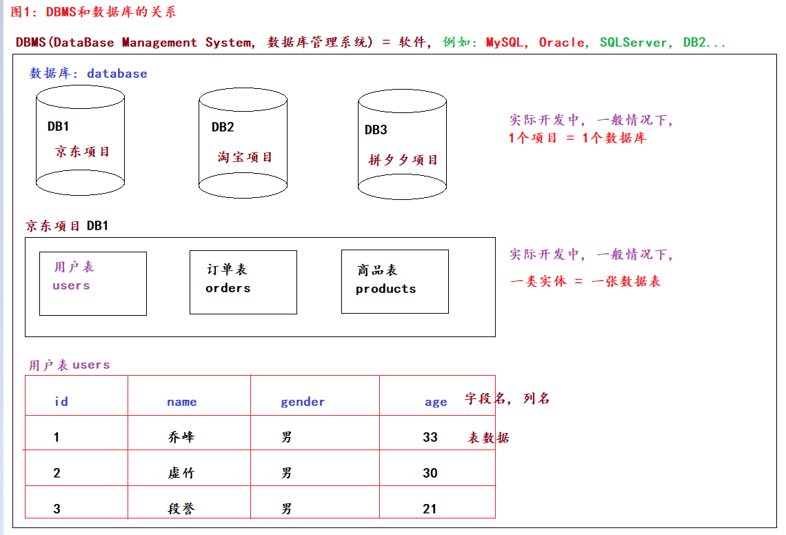

### 一、数据库基本概述

- 存储数据的方式
    - 变量、列表等。只能临时存储数据，程序执行结束数据就丢失了
    - 文件存储。可以永久存储数据，但是不方便进行精细化管理
    - 数据库。
- 数据库管理系统（DBMS）和数据库之间的关系
  
- 关系型数据库和非关系型数据库
    - 关系型数据库。
        - 采用数据表（二维表）的形式存储数据，且表之间有关系。如：一对多、多对多、一对一
        - 非关系型数据库。采用键值对（Key-Value）、文档等形式存储数据
- 常见的数据库
    - 关系型（RDBMS）数据库
        - MySQL、Oracle、SQLServer、DB2、SyBase、SQLite
    - 非关系型（NoSQL）数据库
        - Redis、HBase、MongoDB

### 二、mysql环境搭建

```shell
略
```

### 三、SQL语句详解

- 分类

```shell
DDL：数据定义语言。主要操作数据库、数据表、列名
关键字：create、drop、alter、show...

DML：数据操作语言。主要操作表数据、更新操作（增删改）
关键字：insert、delete、update

DQL：数据查询语言。主要操作表数据、查询操作
关键字：select、from、where

DCL：数据控制语言。主要操作用户、设置权限、隔离级别
```

### 四、DDL语句

- 操作数据库

```mysql
# 1.查看所有的数据库
show databases;

# 2.创建数据库
# 格式：create database if not exists 数据库名 charset '字符集';
create database day01; -- 默认字符集
create database day02 charset 'gbk'; -- 指字符集: gbk
create database if not exists day01;
-- 数据库不存在就创建，存在什么都也不做

# 3.查看(单个)数据库的详细信息
show create database day01;

# 4.修改数据库的（字符集）
alter database day02 charset 'utf8';

# 5.删除指定的数据库
drop database day02;

# 6.切库
use day01;

# 7.查看当前使用的数据库
select database();
```

- 操作数据表

```mysql
# 1.查看（当前数据库）所有的数据表
show tables;

# 2.创建数据表
/*
格式:
    create table [if not exists] 数据表名(
        列名1 数据类型 [约束],
        列名2 数据类型 [约束],
        列名3 数据类型 [约束],
        ...
        列名n 数据类型 [约束]   # 最后1个列名结尾没有逗号
    );
 */
# 需求：创建学生表student。字段（学生编号、姓名 非空约束、性别、年龄）
create table if not exists student
(
    id     int,                  # 学生编号
    name   varchar(20) not null, # 学生姓名，非空
    gender varchar(10),          # 学生性别
    age    int                   # 学生年龄
);

# 3.查看（单个）数据表的详细信息
show create table student;

# 4.修改表名
-- 格式：rename table 旧表名 to 新表名;
rename table student to stu;

# 5.删除指定的数据表
drop table stu;
```

- 操作字段

```mysql
# 1.查看表的所有列
desc student;

# 2.新增列
-- 格式：alter table 表名 add 列名 数据类型 [约束];
alter table student
    add kongfu varchar(20) not null;

# 3. 修改列、数据类型和约束
-- 格式：alter table 表名 modify 列名 数据类型 [约束];
alter table student
    modify kongfu int;
-- 不加约束则会取消之前的约束

# 4.修改列、列名、数据类型和约束
-- 格式：alter table 表名 change 旧列名 新列名 数据类型 [约束];
alter table student
    change kongfu gf varchar(10) not null;

# 5.删除指定的列
-- 格式：alter table 表名 drop 列名;
alter table student
    drop gf;
```

### DML语句

- 操作表数据

```mysql
# -------------------- 案例1：DML语句操作数据表 增 --------------------
/*
格式：
    insert into 表名(列名1, 列名2...) values(值1, 值2...);
    insert into 表名 values(值1, 值2...);
    insert into 表名 values(null, 值2...);
    insert into 表名 values
        (值1, 值2...),
        (值1, 值2...),
        ......
        (值1, 值2...);

细节：
    1.添加表数据时值的个数和类型要和列名保持一致
    2.如果不写列名则默认是全列名，即：必须给所有的列依次赋值
    3.如果是主键列且配合有自增，则传值时可以直接传入null，系统会根据最大主键值 +1，然后存储
    4.如果同时添加多行值，多组值之间用逗号隔开，最后一组值的后边写分号
*/
# 1.添加单条数据.
insert into student(id, name, gender, age)
values (1, '乔峰', '男', 33);
insert into student(name, age) value ('虚竹', 30);

# 2.同时添加多条数据
insert into student
values (1, '阿朱', '女', 30),
       (2, '李清露', '女', 24),
       (3, '王语嫣', '女', 19);

# -------------------- 案例2：DML语句操作数据表 改 --------------------
-- 格式：update 表名 set 字段名1=新值, 字段名2=新值... where 条件;
update student
set id=10,
    name='萧峰'
where id = 1;

-- 如果不写where条件则一下子改变所有
update student
set id=1,
    name='无崖子';

# -------------------- 案例3：DML语句操作数据表 删 --------------------
-- 格式：delete from 表名 where 条件;
delete
from student
where age > 25;

-- 不写where条件则一次删除所有
delete
from student;

# -------------------- 案例4：DQL语句操作数据表 查 --------------------
-- 查询表中所有的数据
select *
from day01.student; # 数据库名.数据表名
select *
from student; # 如果直接写数据表则默认用的是当前库中的表
```