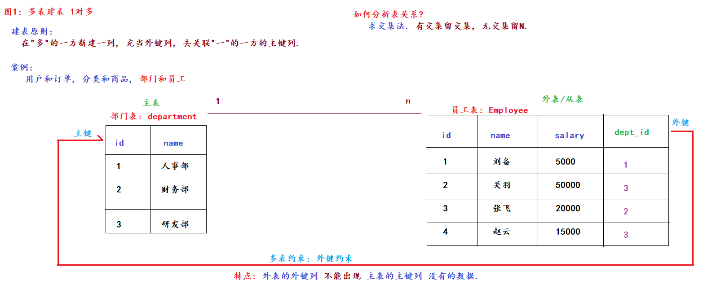

### 一、约束

- 概述：
    - 就是在数据类型的基础上对某列值进一步做限定。如：非空、唯一等...
- 目的：
    - 保证数据的完整性和安全性
- 分类：
    - 单表约束：
        - 主键约束：primary key，一般结合自增auto_increment一起使用。特点：非空、唯一。
        - 非空约束：not null
        - 唯一约束：unique
        - 默认约束：default。如果我们不给值则会用默认值填充
    - 多表约束：
        - 外键约束：foreign key

- 主键约束

```mysql
# 1.建库、切库、查表
drop database if exists day02; -- 如果存在就删除day02数据库
create database day02;
use day02;
show tables;

# 2. 创建学生表。字段（id、name、gender、age）
drop table student;
create table student
(
    id     int primary key auto_increment, # 学生id  主键（非空、唯一、自增）
    name   varchar(20),                    # 学生姓名
    gender varchar(10),                    # 学生性别
    age    int                             # 学生年龄
);

# 3.给学生表添加数据
insert into student
values (1, '萧炎', '男', 33);
insert into student
values (2, '林动', '男', 33);
insert into student
values (10, '牧尘', '男', 31);

# 4.查看学生表结构和数据
desc student; -- 查看表结构
select *
from student; -- 查看表数据
```

- 单表约束

```mysql
# 1.建库、切库、查表
drop database if exists day02; -- 如果存在就删除day02数据库
create database day02;
use day02;
show tables;

# 2.创建teacher表。字段（id 主键约束；name 非空；phone 唯一约束；address 默认：北京）
create table teacher
(
    id      int primary key auto_increment, # 老师id  主键约束（非空、唯一）
    name    varchar(10) not null,           # 姓名  非空约束，必须传值，不能是null
    phone   varchar(11) unique,             # 手机号  唯一约束，不能重复
    address varchar(50) default '北京'      # 住址  默认：北京
);

# 3.添加表数据
insert into teacher
values (null, '夯哥', '13112345678', '新乡');

# 4. 查看表结构和表数据
desc teacher;
select *
from teacher;
```

- 多表约束

```shell
概述
    它是用来描述多表关系的，一般在外表（从表）中做限定
格式
    场景1：建表时创建和以前写字段的方式一样
        [constraint 外键约束名] foreign key(外键列名) references 主表名(主键列名);
    场景2：建表后创建
        alter table 表名 add [constraint 外键约束名] foreign key(外键列名) references 主表名(主键列名);
    场景3: 删除外键约束.
        alter table 表名 drop foreign key 外键约束名;
    注意事项
        1.多表关系之一对多建表原则：在"多"的一方新建一列充当外键列，去关联"一"的一方的主键列
        2.多表关系中有外键的表称之为：外表（从表），有主键的表称之为主表
        3.外键约束特点：外表的外键列不能出现主表的主键列没有的数据
```

### 二、delete和truncate的区别

```mysql
/*
区别：
    1.delete from只删除表数据，不会重置主键id；truncate table相当于把表摧毁了，然后创建一张和该表一模一样的新表
    2.delete from 属于DML语句，可以结合事务一起使用；truncate table属于DDL语句.
 */
# 1.delete from方式删除表数据
delete
from student;

# 3. truncate table方式删除表数据
truncate table student;
truncate student; # 效果同上
```

### 三、备份表数据

```mysql
# 1.查看源表数据
select *
from teacher;

# 2.备份表数据。只会备份表数据、列名、数据类型，不会备份约束（主键约束、唯一约束，因为它们的底层其实是索引）
-- 场景1：备份表不存在
-- 格式：create table 备份表名 select * from 源表名 where 条件...;
create table teacher_tmp
select *
from teacher;

-- 场景2：备份表存在
-- 格式：insert into 备份表名 select * from 源表名 where 条件...;
insert into teacher_tmp
select *
from teacher;

# 3.查看备份表的数据
select *
from teacher_tmp;
-- 清空备份表的数据
truncate table teacher_tmp;

# 4.模拟紧急情况下的"数据恢复"
truncate table teacher;
insert into teacher
select *
from teacher_tmp;
```

### 四、单表查询

```mysql
# 1.创建商品表
create table product
(
    pid         int primary key auto_increment, # 商品id
    pname       varchar(20),                    # 商品名
    price       double,                         # 商品单价
    category_id varchar(32)                     # 商品所属的 分类id
);

# 2.添加表数据
INSERT INTO product(pid, pname, price, category_id)
VALUES (1, '联想', 5000, 'c001');
INSERT INTO product(pid, pname, price, category_id)
VALUES (2, '海尔', 3000, 'c001');
INSERT INTO product(pid, pname, price, category_id)
VALUES (3, '雷神', 5000, null);
INSERT INTO product(pid, pname, price, category_id)
VALUES (4, '杰克琼斯', 800, 'c002');
INSERT INTO product(pid, pname, price, category_id)
VALUES (5, '真维斯', 200, 'c002');
INSERT INTO product(pid, pname, price, category_id)
VALUES (6, '花花公子', 440, null);
INSERT INTO product(pid, pname, price, category_id)
VALUES (7, '劲霸', 2000, 'c002');
INSERT INTO product(pid, pname, price, category_id)
VALUES (8, '香奈儿', 800, 'c003');
INSERT INTO product(pid, pname, price, category_id)
VALUES (9, '相宜本草', 200, 'c003');
INSERT INTO product(pid, pname, price, category_id)
VALUES (10, '面霸', 5, 'c003');
INSERT INTO product(pid, pname, price, category_id)
VALUES (11, '好想你枣', 56, 'c004');
INSERT INTO product(pid, pname, price, category_id)
VALUES (12, '香飘飘奶茶', 1, 'c005');
INSERT INTO product(pid, pname, price, category_id)
VALUES (13, '海澜之家', 1, 'c002');

-- ------------------------------- 简单查询 -------------------------------
/*
 一个单表查询的完整语法如下
    select
        distinct 列1, 列2...
    from
        数据表名
    where
        组前筛选
    group by
        分组字段
    having
        组后筛选
    order by
        排序字段 [asc | desc]
    limit
        起始索引, 数据条数;
 */
# 1.查询所有的商品
select pid, pname, price, category_id
from product;
select *
from product;

# 2.查询商品名和商品价格
select pname, price
from product;

# 3.查询结果是表达式（运算查询）：将所有商品的价格+10元进行显示
select pname, price + 10
from product;

# 4. 起别名。as 别名即可，as可以省略不写
select pname, price + 10 as 价格
from product;
select pname, price + 10 价格
from product;

-- ------------------------------- 条件查询 -------------------------------
/*
格式:
    select * from 表名 where 条件;
条件可以是:
    比较运算符:
        >, >=, <, <=, =, !=, <>
    范围判断:
        between 起始值 and 结束值     包左包右.
        in (值1, 值2, 值3);          满足任意1个条件即可.
    模糊查询:
        like '张%'       %代表任意个占位符, _代表1个占位符.
    逻辑运算符:
        and     并且的意思, 叫: 逻辑与, 要求所有的条件都要满足.
        or      或者的意思, 叫: 逻辑或, 要求满足任意1个条件即可.
        not     取反的意思, 叫: 逻辑非, 取相反的条件即可.
*/
# 1.查询商品名称为“花花公子”的商品所有信息
select *
from product
where pname = '花花公子';
select *
from product
where pname in ('花花公子');
# 2.查询价格为800商品
select *
from product
where price = 800;
select *
from product
where price in (800);
# 3.查询价格不是800的所有商品
select *
from product
where price != 800;
select *
from product
where price <> 800;
select *
from product
where price not in (800);
# 4.查询商品价格大于60元的所有商品信息
select *
from product
where price > 60;
select *
from product
where not price <= 60;
# 5.查询商品价格小于等于800元的所有商品信息
select *
from product
where price <= 800;
# 6.查询商品价格在200到1000之间所有商品
select *
from product
where price between 200 and 800; -- 包左包右
select *
from product
where price >= 200
  and price <= 800;
# 7.查询商品价格是200或800的所有商品
select *
from product
where price = 200
   or price = 800;
select *
from product
where price in (200, 800);
# 8.查询价格不是800的所有商品
select *
from product
where price != 800;
select *
from product
where price <> 800;
select *
from product
where price not in (800);
# 9.查询以'香'开头的所有商品
select *
from product
where pname like '香%';
select *
from product
where pname like '香_'; # 两个字：第1个字是香，第2个字无所谓
select *
from product
where pname like '香__';
# 三个字：第1个字是香，剩下2个字无所谓
# 10.查询第二个字为'想'的所有商品
select *
from product
where pname like '_想%';
# 11.查询没有分类的商品
select *
from product
where category_id is null;
# 12.查询有分类的商品
select *
from product
where category_id is not null;

-- ------------------------------- 排序查询 -------------------------------
# 格式：select * from 表名 order by 排序的列1 [asc | desc], 排序的列2 [asc | desc]....;
# 单词：ascending  升序
# 1.使用价格排序（降序）
select *
from product
order by price desc;
# 2.在价格排序（降序）的基础上以分类排序（降序）
select *
from product
order by price desc, category_id desc;

-- ------------------------------- 聚合查询 -------------------------------
/*
概述
    聚合函数用来操作某列数据
分类
    count() 功能是：统计表的总行数（总条数）
    max()   功能是：最大值。只针对于数字列有效
    min()   功能是：最小值。只针对于数字列有效
    sum()   功能是：求总和。只针对于数字列有效
    avg()   功能是：平均值。只针对于数字列有效

面试题：count(*)、count(列)、count(1)的区别
    1.是否统计null值
        count(列)：只统计该列非null值
        count(*)、count(1)：都会统计null值
    2.效率问题
        从高到低分别是：count(主键列) > count(1) > count(*) > count(普通列)
*/

# 1.求product表的总数据条数
select count(1)
from product;
# 2.求商品价格的最大值
select max(price)
from product;
# 3.求商品价格的最小值
select min(price)
from product;
# 4.求商品价格的求总和
select sum(price)
from product;
# 5.求商品价格的平均值
select round(avg(price), 2)
from product;

-- ------------------------------- 分组查询 -------------------------------
/*
解释
    相当于把表按照分组字段分成n个组，然后可以对每组的数据做筛选统计
格式:
    select
        分组字段, 聚合函数...
    from
        表名
    where
        组前筛选
    group by
        分组字段
    having
        组后筛选;
细节:
    1.分组查询的查询列只能出现分组字段或者聚合函数
    2.where是组前筛选，having是组后筛选
    3.分组查询一般要结合聚合函数一起使用，否则没有意义

面试题：where 和 having的区别
    where：组前筛选，后边不能跟聚合函数
    having：组后筛选，后边可以跟聚合函数
*/
# 1.统计各个分类商品的个数
select product.category_id, count(1)
from product
group by category_id;
# 2.统计各个分类商品的个数，且只显示个数大于1的信息
select product.category_id, count(1) cnt
from product
group by category_id
having cnt > 1;
# 3.统计各个分类商品的个数，且只显示个数大于1的信息，按照商品总数降序排列
select product.category_id, count(1) cnt
from product
group by category_id
having cnt > 1
order by cnt desc;
# 4.统计每类商品的总价格，只统计单价在500以上的商品信息，且只显示总价在2000以上的分组信息，然后按照总价升序排列，求出价格最低的那个分类信息
select product.category_id, sum(product.price) total_price
from product
where price > 500
group by category_id
having total_price > 2000
order by total_price
limit 1;

-- ------------------------------- 分页查询 -------------------------------
/*
概述
    相当于一次性从表中获取n条数据。如：总条数为100条，每页10条，则一共有10页
好处
    1.一方面可以降低服务器、数据库的压力
    2.另一方面可以提高用户体验，阅读性更强
语法格式
    limit 起始索引, 数据条数;
格式解释
    起始索引：表示从索引为几的数据行开始获取数据。数据表中每条数据都有自己的索引，索引是从0开始的
    数据条数：表示获取几条数据
*/
# 1.从商品表中按照5条/页的方式获取数据
select *
from product
limit 0, 5; -- 第1页
select *
from product
limit 5, 5; -- 第2页
select *
from product
limit 10, 5;
-- 第3页
# 2.语法糖：如果起始索引为0则可以省略不写
select *
from product
limit 5;
# floor()：求地板数。即：比这个数字小的所有数字中最大的那个整数
select floor(4.1); -- 4
select floor(4.9);
-- 4

# ceil()：求天花板数。即：比这个数字大的所有数字中最小的那个整数
select ceil(5.3); -- 6
select ceil(5.0);
-- 5

# distinct：去重查询。即：去除重复的数据
select distinct category_id, price
from product;
-- 是把 category_id、price当做整体来去重的

# 方式1: distinct
select distinct category_id
from product;

# 方式2: 分组方式.
select category_id
from product
group by category_id;
```

### 五、多表查询

- 一对多建表
  

```mysql
# 数据准备
-- 部门表
create table dept
(
    id   int primary key auto_increment, # 部门id、主键、自增
    name varchar(10)                     # 部门名
);
-- 员工表
create table employee
(
    id      int primary key auto_increment,                          # 员工id
    name    varchar(20),                                             # 员工姓名
    salary  int,                                                     # 工资
    dept_id int,                                                     # 部门id
    constraint fk_dept_em foreign key (dept_id) references dept (id) # 设置员工表和部门表的外键约束
);
-- 添加数据
insert into dept
values (null, '人事部'),
       (null, '财务部'),
       (null, '研发部');
insert into employee
values (null, '刘备', 5000, 1);
insert into employee
values (null, '关羽', 50000, 3);
-- 手动删除外键约束
alter table employee
    drop foreign key fk_dept_em;
-- 手动添加外键约束
alter table employee
    add foreign key (dept_id) references dept (id);
```

- 交叉查询和连接查询

```mysql
/*
多表查询
    概念
        多表查询的本质就是根据关联条件把多张表变成1张表，然后进行单表查询
    分类
        交叉查询
        连接查询
            内连接
            外连接
            自关联(自连接)查询
        子查询
*/
# 准备数据
CREATE TABLE hero
(
    hid       INT PRIMARY KEY, # 英雄id
    hname     VARCHAR(255),    # 英雄名
    kongfu_id INT              # 功夫id
);
CREATE TABLE kongfu
(
    kid   INT PRIMARY KEY, # 功夫id
    kname VARCHAR(255)     # 功夫名
);
INSERT INTO hero
VALUES (1, '鸠摩智', 9),
       (3, '乔峰', 1),
       (4, '虚竹', 4),
       (5, '段誉', 12);
INSERT INTO kongfu
VALUES (1, '降龙十八掌'),
       (2, '乾坤大挪移'),
       (3, '猴子偷桃'),
       (4, '天山折梅手');
# 交叉查询：查询结果是两张表的笛卡尔积。即：表A的总条数 * 表B的总条数，会有大量的脏数据，实际开发一般不用
-- 格式：select * from 表A, 表B;
select *
from hero,
     kongfu;

# 连接查询
-- 内连接：查询结果是表的交集
-- 场景1：显式内连接。
-- 格式：select * from 表A inner join 表B on 关联条件 where...;
select *
from hero h
         inner join kongfu kf on h.kongfu_id = kf.kid;
select *
from hero h
         join kongfu kf on h.kongfu_id = kf.kid;
-- inner 可以省略不写
-- 场景2：隐式内连接。格式：select * from 表A, 表B  where 关联条件...;
select *
from hero h,
     kongfu kf
where h.kongfu_id = kf.kid;

-- 外连接
-- 场景1：左外连接。查询结果是左表全集 + 交集
-- 格式：select * from 表A left outer join 表B on 关联条件 where...;
select *
from hero h
         left outer join kongfu kf on h.kongfu_id = kf.kid;
select *
from hero h
         left join kongfu kf on h.kongfu_id = kf.kid;
-- outer可以省略不写
-- 场景2：右外连接。查询结果是右表全集 + 交集
-- 格式：select * from 表A right outer join 表B on 关联条件 where...;
select *
from hero h
         right outer join kongfu kf on h.kongfu_id = kf.kid;
select *
from hero h
         right join kongfu kf on h.kongfu_id = kf.kid; -- outer可以省略不写.
```

- 子查询

```mysql
/*
子查询
    概述
        实际开发中，如果1个查询语句的查询条件需要依赖另一个查询语句的查询结果，这种写法就叫子查询。外边的查询叫主查询(父查询)，里边的查询叫子查询
    格式
        |--------- 主查询 ---------- |  |-------- 子查询 ----------|
        select * from 表A where 字段 > (select 列名 from 表B where ....);
*/
# 准备数据
create table category
(                                  # 分类表
    cid   varchar(32) primary key, # 分类id
    cname varchar(50)              # 分类名
);
create table products
(                                        # 商品表
    pid         varchar(32) primary key, # 商品id
    pname       varchar(50),             # 商品名
    price       int,                     # 商品价格
    flag        varchar(2),              # 是否上架标记为：1表示上架、0表示下架
    category_id varchar(32),
    constraint products_fk foreign key (category_id) references category (cid)
);
INSERT INTO category(cid, cname)
VALUES ('c001', '家电');
INSERT INTO category(cid, cname)
VALUES ('c002', '服饰');
INSERT INTO category(cid, cname)
VALUES ('c003', '化妆品');
INSERT INTO category(cid, cname)
VALUES ('c004', '奢侈品');
INSERT INTO products(pid, pname, price, flag, category_id)
VALUES ('p001', '联想', 5000, '1', 'c001');
INSERT INTO products(pid, pname, price, flag, category_id)
VALUES ('p002', '海尔', 3000, '1', 'c001');
INSERT INTO products(pid, pname, price, flag, category_id)
VALUES ('p003', '雷神', 5000, '1', 'c001');
INSERT INTO products (pid, pname, price, flag, category_id)
VALUES ('p004', 'JACK JONES', 800, '1', 'c002');
INSERT INTO products (pid, pname, price, flag, category_id)
VALUES ('p005', '真维斯', 200, '1', 'c002');
INSERT INTO products (pid, pname, price, flag, category_id)
VALUES ('p006', '花花公子', 440, '1', 'c002');
INSERT INTO products (pid, pname, price, flag, category_id)
VALUES ('p007', '劲霸', 2000, '1', 'c002');
INSERT INTO products (pid, pname, price, flag, category_id)
VALUES ('p008', '香奈儿', 800, '1', 'c003');
INSERT INTO products (pid, pname, price, flag, category_id)
VALUES ('p009', '相宜本草', 200, '1', 'c003');
# 1.查询哪些分类的商品已经上架
-- Step1：查询上架的商品的分类id
select distinct category_id
from products
where flag = 1;
-- Step2：根据上一步查出的分类id找其对应的分类名
select *
from category
where cid in ('c001', 'c002', 'c003');
-- Step3：把上述的分解步骤合并到一起
select *
from category
where cid in (select distinct category_id
              from products
              where flag = 1);

# 2。查询所有分类商品的个数
select cname,
       count(category_id) total_cnt, -- 基于业务, 这里写 category_id 更合适.
       count(pid)         total_cnt2 -- 基于效率, 这里写 pid 更合适.
from category c
         left join products p on c.cid = p.category_id -- 外连接查询
group by cname;
```

- 自关联查询

```mysql
/*
自关联查询
    概述
        表自己和自己做关联查询，称之为：自连接(自关联)查询。一般用于省市区三级联动
    格式
        |--------- 主查询 ---------- |  |-------- 子查询 ----------|
        select * from 表A where 字段 > (select 列名 from 表B where ....);
*/
# 准备数据
-- areas.sql脚本文件

# 1.查看所有省的、市、县的信息
select province.id,
       province.title, -- 省的id, 省的名字
       city.id,
       city.title,     -- 市的id, 省的名字
       county.id,
       county.title    -- 县区的id, 省的名字
from areas as county -- 县区表
         join areas as city on county.pid = city.id -- 市表
         join areas as province on city.pid = province.id;
-- 省表

# 2.在上述查询基础上查看河南省所有的信息
select province.id,
       province.title, -- 省的id, 省的名字
       city.id,
       city.title,     -- 市的id, 省的名字
       county.id,
       county.title    -- 县区的id, 省的名字
from areas as county -- 县区表
         join areas as city on county.pid = city.id -- 市表
         join areas as province on city.pid = province.id -- 省表
where province.title = '河南省';

# 3.在上述查询基础上, 查看: 新乡市所有的信息
select province.id,
       province.title, -- 省的id, 省的名字
       city.id,
       city.title,     -- 市的id, 省的名字
       county.id,
       county.title    -- 县区的id, 省的名字
from areas as county -- 县区表
         join areas as city on county.pid = city.id -- 市表
         join areas as province on city.pid = province.id -- 省表
where city.title = '新乡市';
```
