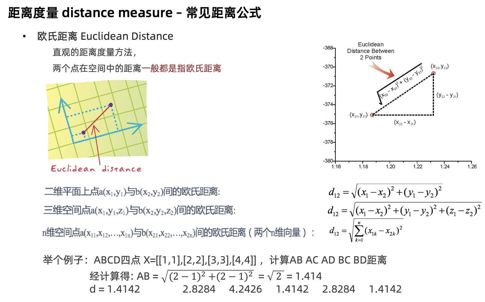
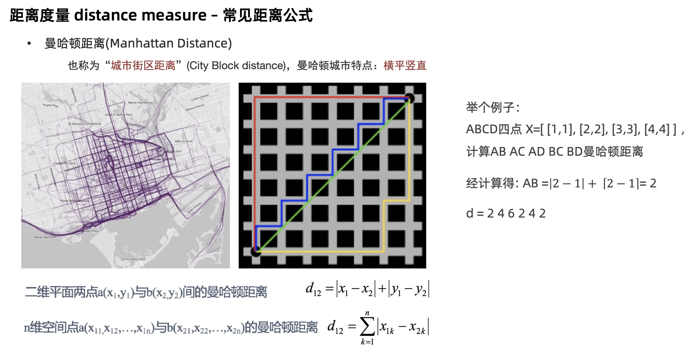
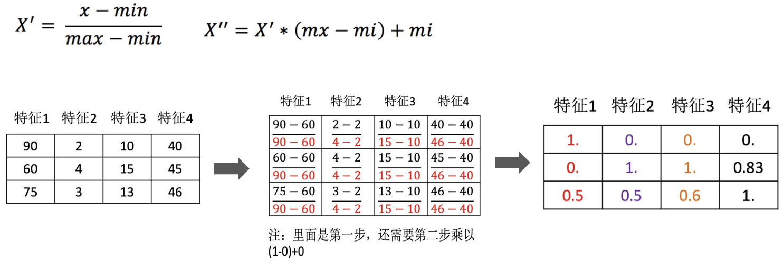
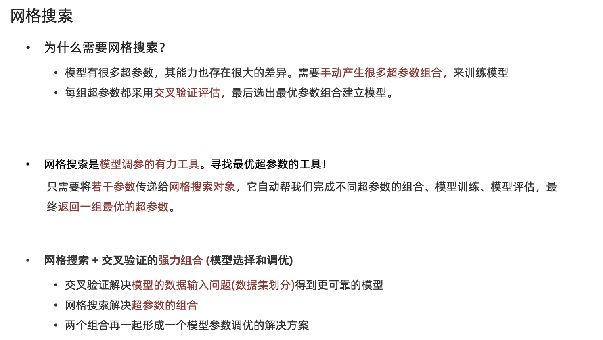
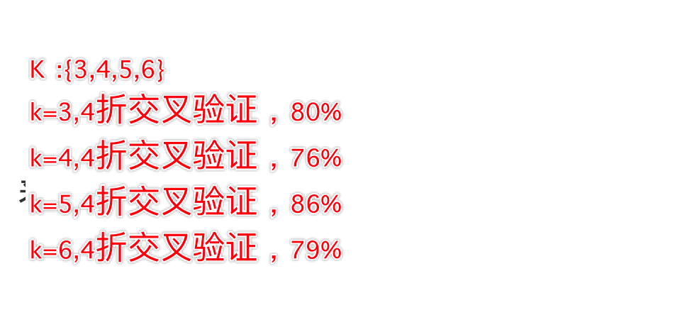

**### 一、KNN算法简介

```text
K-近邻算法（K Nearest Neighbor，简称KNN）
    例如
        根据你的“邻居”来推断出你的类别

KNN算法思想
    如果一个样本在特征空间中的 k 个最相似的样本中的大多数属于某一个类别，则该样本也属于这个类别
    
样本相似性
    样本都是属于一个任务数据集的。样本距离越近则越相似
    
K值的选择
    K值过小
        相当于用较小领域中的训练实例进行预测
        
        容易受到异常点的影响
        K值的减小就意味着整体模型变得复杂，容易发生过拟合
    例如：K=N（N为训练样本数）
        无论输入实例是什么，只会被训练集中最多的类别进行预测，受到样本均衡的影响
    
    
    K值过小
       相当于用较大领域中的训练实例进行预测
    
        受到样本均衡的影响
        K值的增大就意味着整体模型变得简单，容易发生欠拟合
    
    如何对K超参数进行调优
        交叉验证
        网格搜索
```

### 二、KNN的应用方式

```text
解决问题
    分类问题、回归问题

相似性
    欧氏距离

分类问题的处理流程
    1.计算未知样本到每一个训练样本的距离
    2.将训练样本根据距离大小升序排列
    3.取出距离最近的K个训练样本
    4.进行多数表决，统计K个样本中哪个类别的样本个数最多
    5.将未知的样本归属到出现次数最多的类别
    
回归问题的处理流程
    1.计算未知样本到每一个训练样本的距离
    2.将训练样本根据距离大小升序排列
    3.取出距离最近的 K 个训练样本
    4.把这个K个样本的目标值计算其平均值
    5.作为将未知的样本预测的值
```

### 三、API介绍

```text
分类API
    sklearn.neighbors.KNeighborsClassifier(n_neighbors=5)
    n_neighbors：int，可选（默认= 5），k_neighbors查询默认使用的邻居数
     
回归API
    sklearn.neighbors.KNeighborsRegressor(n_neighbors=5)
    
    代码
        # 1.工具包
        from sklearn.neighbors import KNeighborsClassifier, KNeighborsRegressor

        # 2.数据(特征工程)
        # 分类
        # x = [[0,2,3],[1,3,4],[3,5,6],[4,7,8],[2,3,4]]
        # y = [0,0,1,1,0]
        x = [[0,1,2],[1,2,3],[2,3,4],[3,4,5]]
        y = [0.1,0.2,0.3,0.4]

        # 3.实例化
        # model =KNeighborsClassifier(n_neighbors=3)
        model =KNeighborsRegressor(n_neighbors=3)

        # 4.训练
        model.fit(x,y)

        # 5.预测
        print(model.predict([[4,4,5]])) 
```

### 四、距离度量方法

- 欧氏距离
  
    - 曼哈顿距离
      
    - 切比雪夫距离
      
    - 闵氏距离
        - 距离的组合，是对多个距离度量公式的概括性的表述
          

### 五、特征预处理

- 为什么进行归一化、标准化
  特征的单位或者大小相差较大，或者某特征的方差相比其他的特征要大出几个数量级，容易影响（支配）目标结果，使得一些模型（算法）无法学习到其它的特征。
    - 归一化
      通过对原始数据进行变换把数据映射到【mi,mx】（默认为[0,1]）之间
      

数据归一化的API实现
`sklearn.preprocessing.MinMaxScaler (feature_range=(0,1)… )`
feature_range 缩放区间

- 调用fit_transform(X)将特征进行归一化缩放

归一化受到最大值与最小值的影响，这种方法容易受到异常数据的影响, 鲁棒性较差，适合传统精确小数据场景

- 标准化
  通过对原始数据进行标准化，转换为均值为0标准差为1的标准正态分布的数据
  
    - mean为特征的平均值
    - σ为特征的标准差

数据归一化的API实现
`sklearn.preprocessing. StandardScaler()`
调用fit_transform(X)将特征进行归一化缩放

```python
# 1.导入工具包
from sklearn.preprocessing import MinMaxScaler, StandardScaler

# 2.数据(只有特征)
x = [[90, 2, 10, 40], [60, 4, 15, 45], [75, 3, 13, 46]]

# 3.实例化(归一化,标准化)
# process =MinMaxScaler()
process = StandardScaler()

# 4.fit_transform 处理1
data = process.fit_transform(x)
# print(data)

print(process.mean_)
print(process.var_)
```

对于标准化来说，如果出现异常点，由于具有一定数据量，少量的异常点对于平均值的影响并不大

示例：利用KNN算法进行鸢尾花分类

```python
"""
鸢尾花Iris Dataset数据集是机器学习领域经典数据集，鸢尾花数据集包含了150条鸢尾花信息，每50条取自三个鸢尾花中之一：Versicolour、Setosa和Virginica
"""

# 0.导入工具包
from sklearn.datasets import load_iris
import seaborn as sns
import matplotlib.pyplot as plt
import pandas as pd
from sklearn.model_selection import train_test_split
from sklearn.preprocessing import StandardScaler
from sklearn.neighbors import KNeighborsClassifier
from sklearn.metrics import accuracy_score

# 1.加载数据集
iris_data = load_iris()
# print(iris_data)
# print(iris_data.target)


# 2.数据展示
iris_df = pd.DataFrame(iris_data['data'], columns=iris_data.feature_names)
iris_df['label'] = iris_data.target
# print(iris_data.feature_names)
# sns.lmplot(x='sepal length (cm)',y='sepal width (cm)',data = iris_df,hue='label')
# plt.show()


# 3.特征工程(预处理-标准化)
# 3.1 数据集划分
x_train, x_test, y_train, y_test = train_test_split(iris_data.data, iris_data.target, test_size=0.3, random_state=22)
print(len(iris_data.data))
print(len(x_train))
# 3.2 标准化
process = StandardScaler()
x_train = process.fit_transform(x_train)
x_test = process.transform(x_test)
# 4.模型训练
# 4.1 实例化
model = KNeighborsClassifier(n_neighbors=3)
# 4.2 调用fit法
model.fit(x_train, y_train)
# 5.模型预测
x = [[5.1, 3.5, 1.4, 0.2]]
x = process.transform(x)
y_predict = model.predict(x_test)
print(model.predict_proba(x))

# 6.模型评估(准确率)
# 6.1 使用预测结果
acc = accuracy_score(y_test, y_predict)
print(acc)

# 6.2 直接计算
acc = model.score(x_test, y_test)
print(acc)
```

### 六、超参数选择的方法

- 交叉验证
  交叉验证是一种数据集的分割方法，将训练集划分为n份，其中一份做验证集、其他n-1份做训练集集
  原理：将数据集划分为cv=10份
    - 1.第一次：把第一份数据做验证集，其他数据做训练
    - 2.第二次：把第二份数据做验证集，其他数据做训练
    - 3.以此类推，总共训练10次，评估10次
    - 4.使用训练集+验证集多次评估模型，取平均值做交叉验证为模型得分
    - 5.若k=5模型得分最好，再使用全部训练集（训练集+验证集）对k=5模型再训练一遍，再使用测试集对k=5模型做评估

  目的
    - 得到更加准确可信的模型评分

- 网格搜索
  
  

  交叉验证网格搜索的API
  

  交叉验证网格搜索在鸢尾花分类中的应用
```python
# 0.导入工具包
from sklearn.datasets import load_iris
from sklearn.model_selection import train_test_split,GridSearchCV
from sklearn.preprocessing import StandardScaler
from sklearn.neighbors import KNeighborsClassifier
from sklearn.metrics import accuracy_score

# 1.加载数据
data = load_iris()

# 2 数据集划分
x_train,x_test,y_train,y_test=train_test_split(data.data,data.target,test_size=0.2,random_state=22)

# 3.特征预处理
pre = StandardScaler()
x_train=pre.fit_transform(x_train)
x_test=pre.transform(x_test)

# 4.模型实例化+交叉验证+网格搜索
model = KNeighborsClassifier(n_neighbors=1)
paras_grid = {'n_neighbors':[4,5,7,9]}
# estimator =GridSearchCV(estimator=model,param_grid=paras_grid,cv=4)
# estimator.fit(x_train,y_train)

# print(estimator.best_score_)
# print(estimator.best_estimator_)
# print(estimator.cv_results_)

model = KNeighborsClassifier(n_neighbors=7)
model.fit(x_train,y_train)
x = [[5.1, 3.5, 1.4, 0.2]]
x=pre.transform(x)
y_prdict=model.predict(x_test)

print(accuracy_score(y_test,y_prdict))
```
