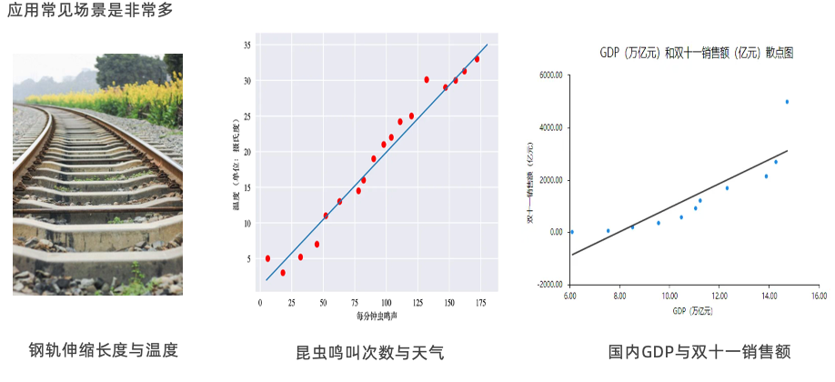

### 一、线性回归介绍

- 线性回归
  是利用回归方程（函数）对一个或多个自变量（特征值）和因变量（目标值）之间关系进行建模的一种分析方式

- 线性回归分类
    - 一元线性回归
      y = kx +b
      目标值只与一个因变量有关系
    - 多元线性回归
      y = w1x1 + w2x2 + w3x3 + ... + b
      目标值只与多个因变量有关系

- 应用场景
  

### 二、线性回归问题的求解

- 线性回归API的应用
  

- 损失函数
  误差：用预测值y – 真实值y就是误差
  损失函数：衡量每个样本预测值与真实值效果的函数

- 导数和矩阵
    - 常见的数据表述
      标量（scalar）：一个独立存在的数，只有大小没有方向
      向量（vector）：向量指一列顺序排列的元素。默认是列向量
      矩阵（matrix）：二维数组
      张量（Tensor）：多维数组，张量是基于向量和矩阵的推广

    - 导数
    - 偏导
    - 向量
    - 矩阵
  