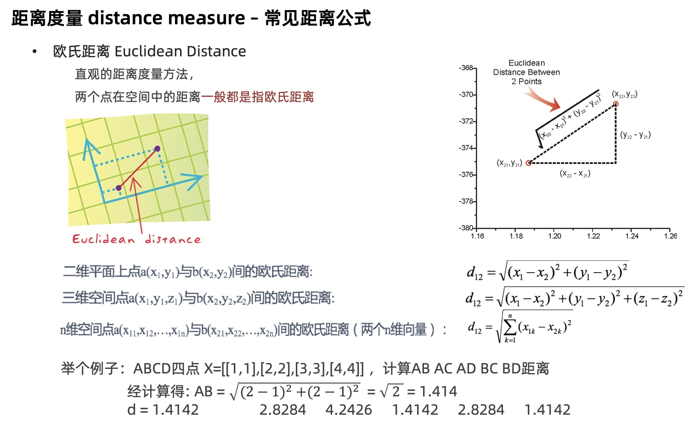
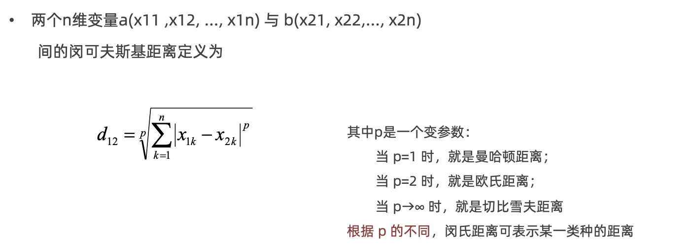
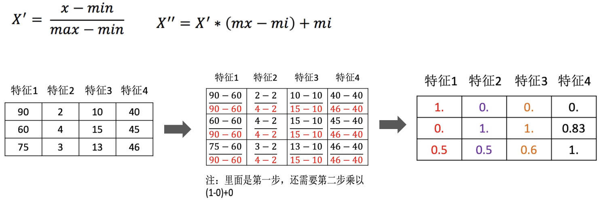

**### 一、KNN算法简介

```text
K-近邻算法（K Nearest Neighbor，简称KNN）
    例如
        根据你的“邻居”来推断出你的类别

KNN算法思想
    如果一个样本在特征空间中的 k 个最相似的样本中的大多数属于某一个类别，则该样本也属于这个类别
    
样本相似性
    样本都是属于一个任务数据集的。样本距离越近则越相似
    
K值的选择
    K值过小
        相当于用较小领域中的训练实例进行预测
        
        容易受到异常点的影响
        K值的减小就意味着整体模型变得复杂，容易发生过拟合
    例如：K=N（N为训练样本数）
        无论输入实例是什么，只会被训练集中最多的类别进行预测，受到样本均衡的影响
    
    
    K值过小
       相当于用较大领域中的训练实例进行预测
    
        受到样本均衡的影响
        K值的增大就意味着整体模型变得简单，容易发生欠拟合
    
    如何对K超参数进行调优
        交叉验证
        网格搜索
```

### 二、KNN的应用方式

```text
解决问题
    分类问题、回归问题

相似性
    欧氏距离

分类问题的处理流程
    1.计算未知样本到每一个训练样本的距离
    2.将训练样本根据距离大小升序排列
    3.取出距离最近的K个训练样本
    4.进行多数表决，统计K个样本中哪个类别的样本个数最多
    5.将未知的样本归属到出现次数最多的类别
    
回归问题的处理流程
    1.计算未知样本到每一个训练样本的距离
    2.将训练样本根据距离大小升序排列
    3.取出距离最近的 K 个训练样本
    4.把这个K个样本的目标值计算其平均值
    5.作为将未知的样本预测的值
```

### 三、API介绍

```text
分类API
    sklearn.neighbors.KNeighborsClassifier(n_neighbors=5)
    n_neighbors：int，可选（默认= 5），k_neighbors查询默认使用的邻居数
     
回归API
    sklearn.neighbors.KNeighborsRegressor(n_neighbors=5)
    
    代码
        # 1.工具包
        from sklearn.neighbors import KNeighborsClassifier, KNeighborsRegressor

        # 2.数据(特征工程)
        # 分类
        # x = [[0,2,3],[1,3,4],[3,5,6],[4,7,8],[2,3,4]]
        # y = [0,0,1,1,0]
        x = [[0,1,2],[1,2,3],[2,3,4],[3,4,5]]
        y = [0.1,0.2,0.3,0.4]

        # 3.实例化
        # model =KNeighborsClassifier(n_neighbors=3)
        model =KNeighborsRegressor(n_neighbors=3)

        # 4.训练
        model.fit(x,y)

        # 5.预测
        print(model.predict([[4,4,5]])) 
```

### 四、距离度量方法

- 欧氏距离
  
- 曼哈顿距离
  
- 切比雪夫距离
  
- 闵氏距离
    - 距离的组合，是对多个距离度量公式的概括性的表述
      

### 五、特征预处理

- 为什么进行归一化、标准化
  特征的单位或者大小相差较大，或者某特征的方差相比其他的特征要大出几个数量级，容易影响（支配）目标结果，使得一些模型（算法）无法学习到其它的特征。
- 归一化
  通过对原始数据进行变换把数据映射到【mi,mx】（默认为[0,1]）之间
  
    - 数据归一化的API实现
      `sklearn.preprocessing.MinMaxScaler (feature_range=(0,1)… )`
    - feature_range 缩放区间
        - 调用fit_transform(X)将特征进行归一化缩放

  归一化受到最大值与最小值的影响，这种方法容易受到异常数据的影响, 鲁棒性较差，适合传统精确小数据场景
- 标准化
  通过对原始数据进行标准化，转换为均值为0标准差为1的标准正态分布的数据
  
    - mean为特征的平均值
    - σ为特征的标准差

  - 数据归一化的API实现
    `sklearn.preprocessing. StandardScaler()`
  - 调用fit_transform(X)将特征进行归一化缩放
    ```python
# 1.导入工具包
from sklearn.preprocessing import MinMaxScaler,StandardScaler

# 2.数据(只有特征)
x = [[90, 2, 10, 40], [60, 4, 15, 45], [75, 3, 13, 46]]

# 3.实例化(归一化,标准化)
# process =MinMaxScaler()
process =StandardScaler()

# 4.fit_transform 处理1
data =process.fit_transform(x)
# print(data)

print(process.mean_)
print(process.var_)
```


