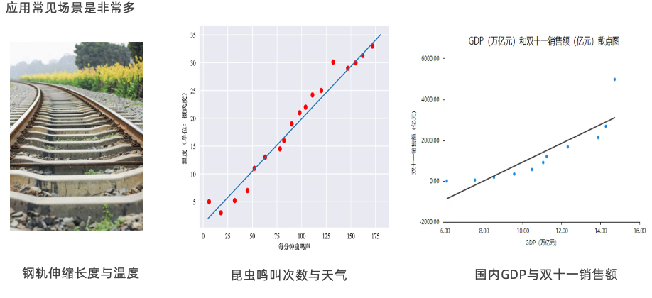

### 一、线性回归介绍

- 线性回归
  是利用回归方程（函数）对一个或多个自变量（特征值）和因变量（目标值）之间关系进行建模的一种分析方式

- 线性回归分类
    - 一元线性回归
      y = kx +b
      目标值只与一个因变量有关系
    - 多元线性回归
      y = w1x1 + w2x2 + w3x3 + ... + b
      目标值只与多个因变量有关系

- 应用场景
  