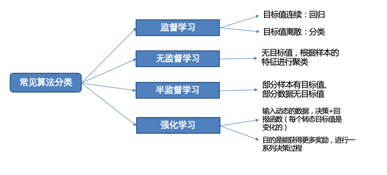
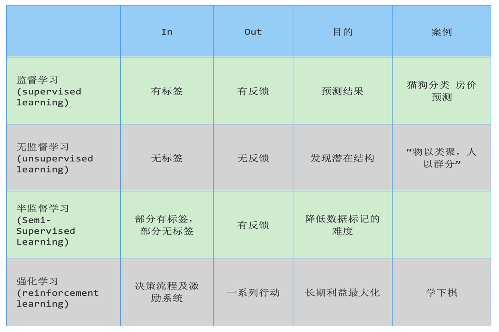
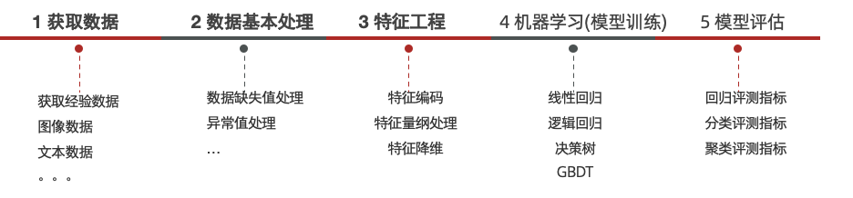

### 一、人工智能三大概念

```shell
人工智能（Artificial Intelligence）
  仿智；像人一样机器智能的综合与分析；机器模拟人类

机器学习（Machine Learning）
  让机器自动学习，而不是基于规则的编程（不依赖特定规则编程）
  
深度学习（Deep Learning）
  也叫深度神经网络，大脑仿生，设计一层一层的神经元模拟万事万物
  
三者之间的关系
  机器学习是实现人工智能的一种途径
  深度学习是机器学习的一种方法

机器学习发展三要素
  数据、算法、算力三要素相互作用，是AI发展的基石
    1. CPU：负责调度任务，计算任务等；主要适合I\O密集型的任务
    2. GPU：更加适合矩阵运算；主要适合计算密集型任务
    3. TPU：Tensor，专门针对神经网络训练设计的一款处理器
```

### 二、常见术语

- 样本（sample）
    - 一行数据就是一个样本，多个样本组成数据集，有时一条样本被叫成一条记录
- 特征（feature）
    - 一列数据一个特征，有时也被称为属性
- 标签/目标（label/target）
    - 模型要预测的那一列数据
- 数据集划分
    - 训练集（training set）：用来训练模型（model）的数据集
    - 测试集（testing set）：用来测试模型的数据集

### 三、算法分类

```shell
有监督学习
  定义
    输入数据是由输入特征值和目标值所组成，即输入的训练数据有标签的
  数据集
    需要人工标注数据
  分类
    目标值（标签值）是不连续的
    种类
      二分类
      多分类
  回归
    目标值（标签值）是连续的

无监督学习
  定义
    输入数据没有被标记。即样本数据类别未知，没有标签，根据样本间的相似性对样本集聚类，以发现事物内部结构及相互关系
  数据集
    不需要标注数据
  特点
    1.训练数据无标签
    2.根据样本间的相似性对样本集进行聚类，发现事物内部结构及相互关系

半监督学习
  工作原理
    1.让专家标注少量数据，利用已经标记的数据（也就是带有类标签）训练出一个模型
    2.再利用该模型去套用未标记的数据
    3.通过询问领域专家分类结果与模型分类结果做对比，从而对模型做进一步改善和提高
  半监督学习方式可大幅降低标记成本
  
强化学习
  基本原理
    通过构建四个要素：agent、环境状态、行动、奖励，agent根据环境状态进行行动获得最多的累计奖励
  案例：小孩子学走路
    1.小孩就是agent，他试图通过采取行走来操纵环境（地面）
    2.并且从一个状态转变到另一个状态（即他走的每一步）
    3.当他完成任务的子任务（即走了几步）时，孩子得到奖励（给巧克力吃）
    4.当他不能走路时，就不会给巧克力
```

- 总结
  
  
  

### 四、机器学习的建模流程


### 五、特征工程
```text
特征工程
    从数据集角度来看：一列一列的数据为特征
```